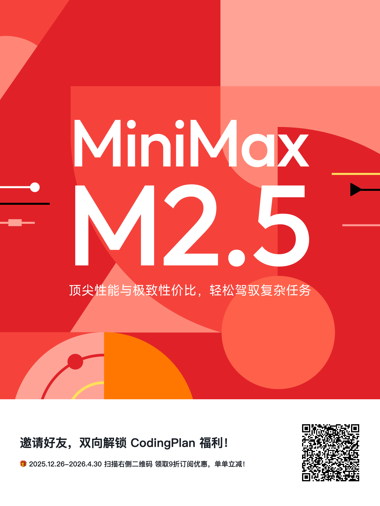

# OpenClaw 异步 Telegram Bot Skill

[](./LICENSE)
[](./SKILL.md)
[](https://smithery.ai/skills/nebutra/openclaw-async-telegram-bot-skill)

[English](./README.md) | 简体中文

把一个 OpenClaw，快速扩展成可并行运行的 Telegram Bot 矩阵。

这个 Skill 用一套可重复 SOP 自动完成机器人接入，并带安全护栏：
- 通过 Telegram `getMe` 校验 Bot Token
- 强制用户名规则 `Nebutra###_bot`
- 按序号自动映射古希腊哲学家英文名
- 自动写入 OpenClaw Telegram 账号配置
- 自动重启网关并做健康检查
- 可选：为每个 Bot 创建独立 Agent，支持并行工作流

## 10 秒安装

```bash
npx skills add https://github.com/Nebutra/OpenClaw-Async-Telegram-Bot-Skill --skill openclaw-async-telegram-bot
```

发现页：
- Smithery: https://smithery.ai/skills/nebutra/openclaw-async-telegram-bot-skill
- Skills 目录: https://skills.sh/nebutra/openclaw-async-telegram-bot-skill/openclaw-async-telegram-bot

## 快速开始

```bash
# 新增/更新一个 Telegram Bot 账号
bash scripts/add_async_telegram_bot.sh --token "<BOTFATHER_TOKEN>"

# 新增 Bot 并创建绑定该账号的独立 Agent
bash scripts/add_async_telegram_bot.sh --token "<BOTFATHER_TOKEN>" --agent-id "plato-agent"
```

## 国内用户：OpenClaw + MiniMax 国内 API 一键配置

如果你使用的是 MiniMax 国内 API，可直接执行下面命令完成覆盖配置（`baseUrl`、`authHeader`、模型窗口、默认模型）：

```bash
export MINIMAX_API_KEY="你的 MiniMax Key"

bash -c '
set -euo pipefail
CFG="$HOME/.openclaw/openclaw.json"
[ -f "$CFG" ] || { echo "未找到 $CFG，请先运行 openclaw onboard"; exit 1; }
[ -n "${MINIMAX_API_KEY:-}" ] || { echo "请先设置 MINIMAX_API_KEY"; exit 1; }

TMP="$(mktemp)"
jq --arg key "$MINIMAX_API_KEY" \
  '"'"'.models.mode = "merge"
  | .models.providers.minimax.baseUrl = "https://api.minimaxi.com/anthropic"
  | .models.providers.minimax.api = "anthropic-messages"
  | .models.providers.minimax.authHeader = true
  | .models.providers.minimax.apiKey = $key
  | .models.providers.minimax.models = [
      {
        "id": "MiniMax-M2.5",
        "name": "MiniMax M2.5",
        "reasoning": false,
        "input": ["text"],
        "cost": { "input": 15, "output": 60, "cacheRead": 2, "cacheWrite": 10 },
        "contextWindow": 204800,
        "maxTokens": 8192
      }
    ]
  | .agents.defaults.model.primary = "minimax/MiniMax-M2.5"
  | .agents.defaults.models["minimax/MiniMax-M2.5"] = (.agents.defaults.models["minimax/MiniMax-M2.5"] // {})
  | .agents.defaults.contextTokens = 204800
  | .agents.defaults.thinkingDefault = "off"
  '"'"' "$CFG" > "$TMP"

mv "$TMP" "$CFG"
openclaw gateway restart
openclaw channels status --probe
'
```

完成后可用以下命令自检：

```bash
openclaw tui
```

预期状态：
- 模型显示 `minimax/MiniMax-M2.5`
- 上下文接近 `205k`（即 204800）
- `think` 默认关闭（`off`）

## 为什么适合增长团队

- 激活快：从 Token 到可用 Channel 只需一条命令。
- 默认安全：自动拦截错误用户名和不健康账号状态。
- 并行运营：一 Bot 一场景，支持多渠道/多人群并发。
- 命名统一：路由清晰、交接成本低。
- 可复制 SOP：减少手工改配置导致的错误。

## 黑客增长打法（可直接照抄）

1. 在 BotFather 批量创建 `Nebutra###_bot`。
2. 用脚本逐个接入 Token。
3. 每个 Bot 绑定独立 Agent（`--agent-id`）。
4. 按流量来源或用户分层分配 Bot。
5. 按 Bot 粒度统计转化，持续迭代提示词和流程。

示例分工：
- `Socrates`：线索初筛
- `Plato`：新用户引导
- `Aristotle`：留存与召回

## MiniMax CodingPlan 邀请码

- 邀请码：`6jBWg7zvmE`
- 邀请链接（扫码同款，活动页）：https://platform.minimaxi.com/subscribe/coding-plan?code=6jBWg7zvmE&source=img



## 命令参考

```bash
# 指定 account id
bash scripts/add_async_telegram_bot.sh --token "<TOKEN>" --account-id "plato-007"

# 指定显示名
bash scripts/add_async_telegram_bot.sh --token "<TOKEN>" --name "Plato"

# 仅预演，不落地
bash scripts/add_async_telegram_bot.sh --token "<TOKEN>" --dry-run

# 跳过网关重启
bash scripts/add_async_telegram_bot.sh --token "<TOKEN>" --skip-restart

# 创建 Agent 时指定模型
bash scripts/add_async_telegram_bot.sh --token "<TOKEN>" --agent-id "plato-agent" --model "MiniMax-M2.5"
```

## 安全约束

- 用户名必须匹配：`^Nebutra[0-9]{3}_bot$`
- Token 必须通过 Telegram API 校验
- 健康检查必须通过：`running=true` 且 `probe.ok=true`
- 自动防止 account-id 与已有 bot-id 冲突

## 仓库结构

- `SKILL.md`：Skill 触发规则与执行流程
- `scripts/add_async_telegram_bot.sh`：生产可用的接入脚本

## 依赖

- `openclaw`
- `curl`
- `jq`

## 许可证

MIT
